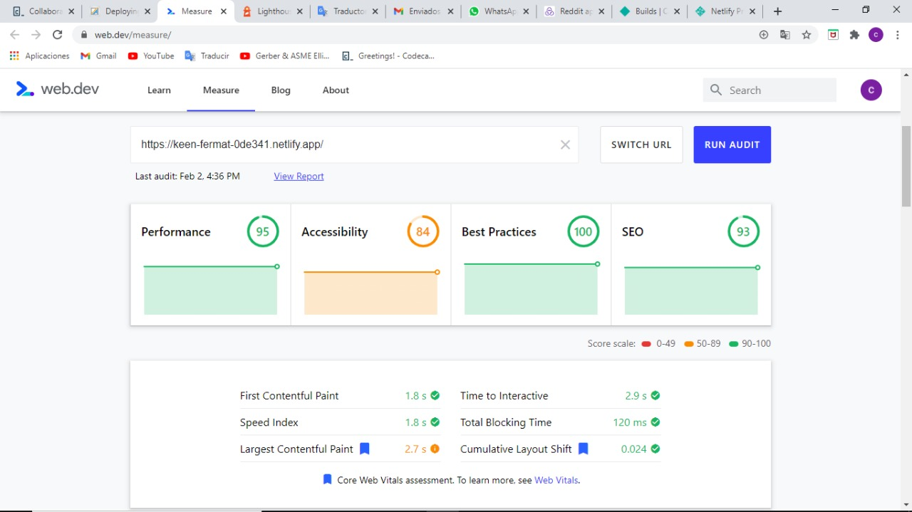
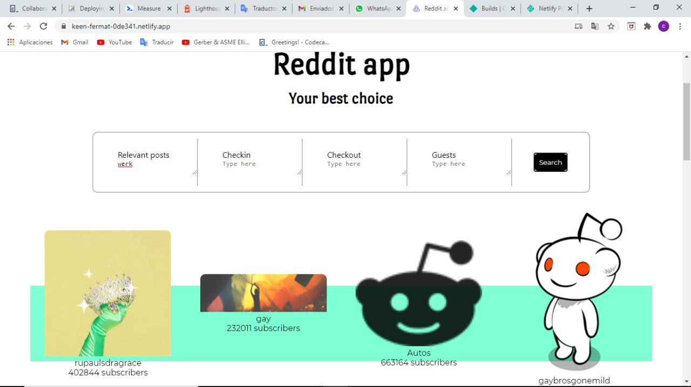

# Project Name

> reddit-app.

## Table of contents

- [Project Name](#project-name)
  - [Table of contents](#table-of-contents)
  - [General info](#general-info)
  - [Screenshots](#screenshots)
  - [Technologies](#technologies)
  - [Setup](#setup)
  - [Code Examples](#code-examples)
  - [Features](#features)
  - [Status](#status)
  - [Inspiration](#inspiration)
  - [Contact](#contact)

## General info

The purpose of the proyect was to make a web app with react-redux technologies.

## Screenshots

Background image screenshot:




## Technologies

- React.js
- Redux

## Setup

[Home page deployed with Netlify](https://keen-fermat-0de341.netlify.app/)

## Code Examples

Example of usage:

```javascript
import { configureStore } from '@reduxjs/toolkit';
import RedditReducer from "../features/reddit/RedditSlice";
import SubRedditReducer from "../features/subReddit/SubRedditSlice";

export default configureStore({
  reducer: {
    reddit: RedditReducer,
    subreddit: SubRedditReducer
  },
});
```

## Features

List of features:

- AJAX requests to the reddit API.
- Search for relevant posts that give extra info related to the subredit.
- responsive design

## Status

Project is: In progress.

there are still some features left to implement, including design for cellphones.

## Inspiration

I was motivated by the big step it means to write my first react app.

## Contact

Created by [@CarlosHernández](https://linkedin.com/in/carlos-manuel-hernández-consuegra-42975a189) - feel free to contact me!
