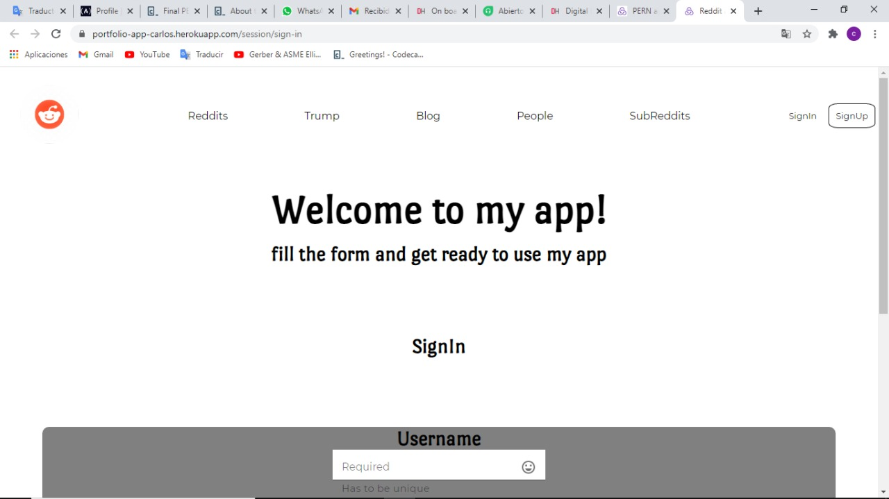

# Project Name

> PERN-app.

## Table of contents

- [Project Name](#project-name)
  - [Table of contents](#table-of-contents)
  - [General info](#general-info)
  - [Screenshots](#screenshots)
  - [Technologies](#technologies)
  - [Setup](#setup)
  - [Code Examples](#code-examples)
  - [Features](#features)
  - [Status](#status)
  - [Inspiration](#inspiration)
  - [Contact](#contact)

## General info

The purpose of the proyect was to make a PERN web app.

## Screenshots

Background image screenshot:



## Technologies

- React
- Redux
- PostgreSQL
- Express.js
- Passport.js

## Setup

[Deployed with Heroku](https://portfolio-app-carlos.herokuapp.com/)

## Code Examples

Example of usage:

```javascript
passport.use(new LocalStrategy((username, password, cb) => {
  dbGray.query('SELECT id, username, password, type FROM users WHERE username=$1', [username], (err, result) => {
   if (err) throw err;
   if(result.rows.length > 0) {
    const first = result.rows[0]
    bcrypt.compare(password, first.password, function(err, res) {
     if(res) {
      cb(null, { id: first.id, username: first.username, type: first.type })
     } else {
      cb(null, false)
     }
    })
   } else {
    cb(null, false)
   }
  })
 }))
```

## Features

List of features:

- AJAX requests to the reddit API.
- Search for relevant posts that give extra info related to the subredit.
- responsive design
- Information about Trump's Twitter account insults stored in the database.
- Session
- Authentication

## Status

Project is: In progress.

there are still some features left to implement, will be planned in the future.

## Inspiration

I was motivated by the big step it means to write my PERN app.

## Contact

Created by [@CarlosHernández](https://linkedin.com/in/carlos-manuel-hernández-consuegra-42975a189) - feel free to contact me!
